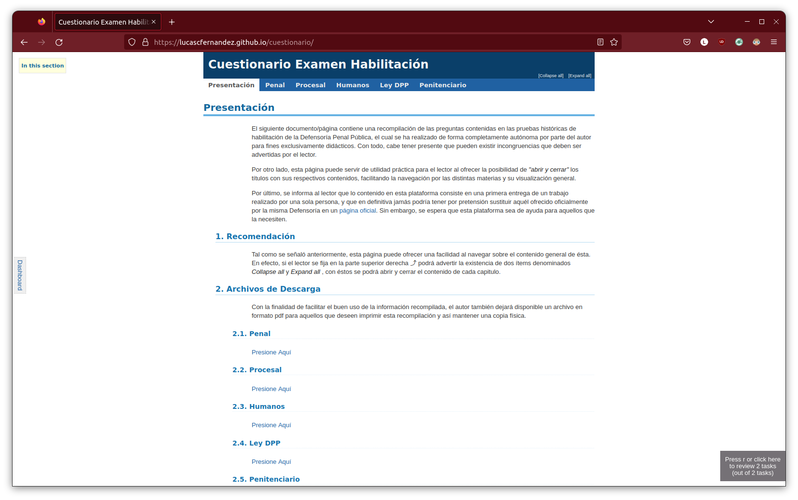
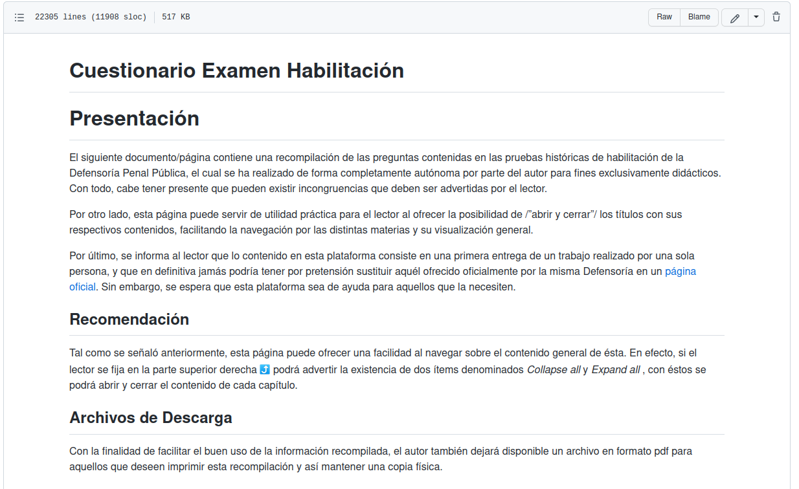

# Cuestionario

Recompilación de exámenes habilitantes de la Defensoria Penal Pública
para fines educativos.

## Presentación

El siguiente trabajo está dirigido a las personas que deseen preparar
el examen de habilitación de la Defensoría Penal Pública (Chile), y
consiste en una recompilación de los exámenes históricos ofrecidos por
la misma institución en su página oficial con sus respectivas
respuestas y organizados por materia y tipo de pregunta.

📑 [Ir a la Página](https://lucascfernandez.github.io/cuestionario/)

## Suporte

El contenido de este trabajo también puede ser descargado y utilizado
por los usuarios que deseen clonar este repositorio. En ese sentido
bastará que modifiquen el archivo .org y lo exporten a html en emacs.

📔 [Ver archivo](https://github.com/lucascfernandez/cuestionario/blob/main/cuestionario.org)

